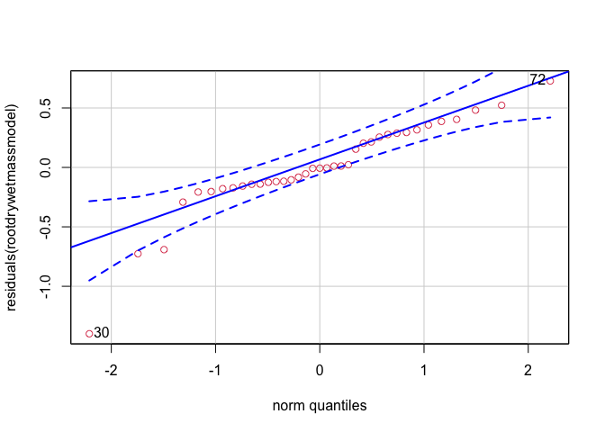
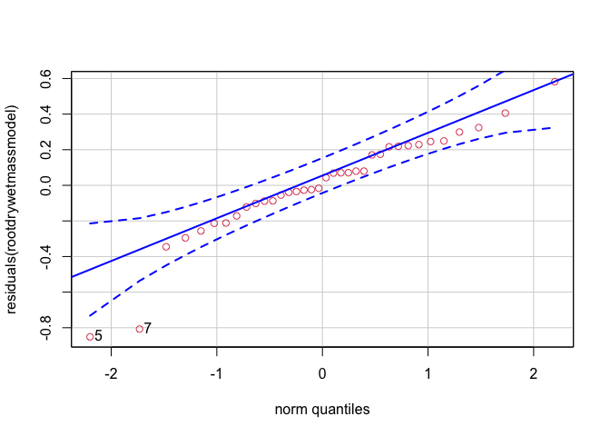
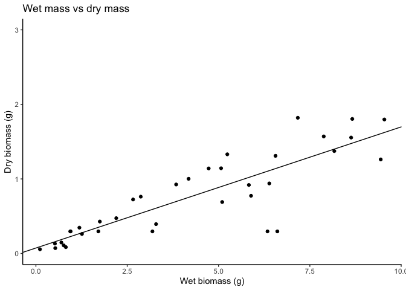
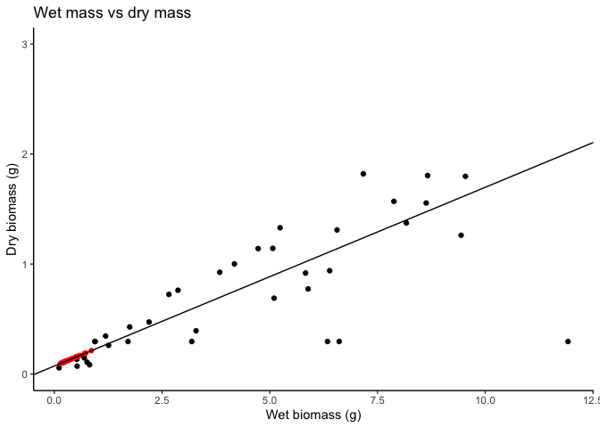
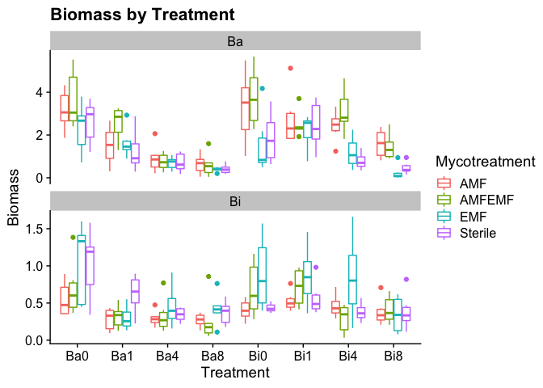
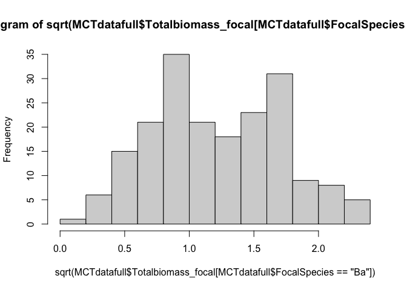
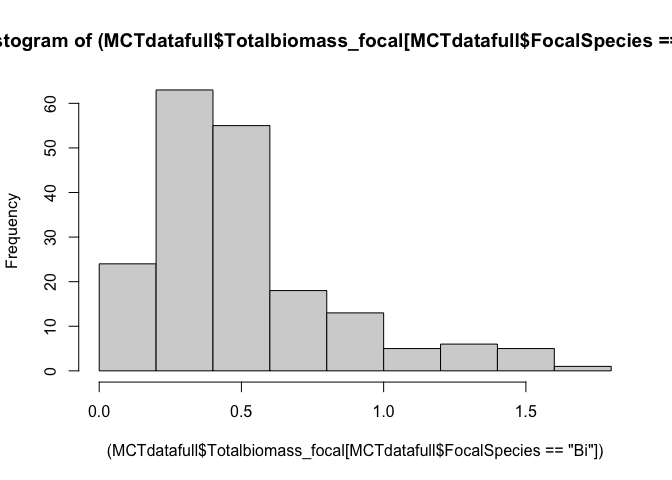
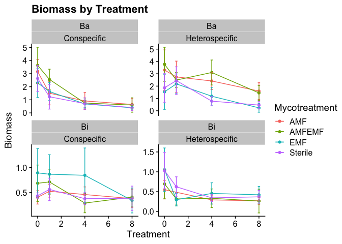
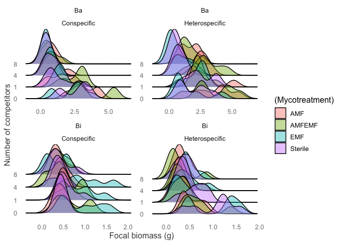
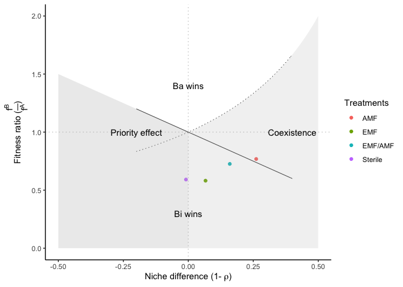

MCT\_EMAMCompetition
================
Claire Willing
2/9/2021

Data clean-up and pre-processing

``` r
setwd("~/Dropbox/Research/Postdoc/MCT_BaBi/DataAnalysis/")
MCTdataRAW=read.csv("MCT_BaBi_FullDataSheet.csv", header = T)
attach(MCTdataRAW)

#linear model
rootdrywetmassmodel<-lm(formula = Rootmass_g~Rootmass_focal_wet_g_minuspercol, data = MCTdataRAW)

library(car)
qqp(residuals(rootdrywetmassmodel), col=2)
```

<!-- -->

    ## 30 72 
    ##  4 10

``` r
summary(rootdrywetmassmodel)
```

    ## 
    ## Call:
    ## lm(formula = Rootmass_g ~ Rootmass_focal_wet_g_minuspercol, data = MCTdataRAW)
    ## 
    ## Residuals:
    ##      Min       1Q   Median       3Q      Max 
    ## -1.39938 -0.14137 -0.00662  0.27694  0.72733 
    ## 
    ## Coefficients:
    ##                                  Estimate Std. Error t value Pr(>|t|)    
    ## (Intercept)                       0.18339    0.11062   1.658    0.106    
    ## Rootmass_focal_wet_g_minuspercol  0.12684    0.02051   6.185 4.41e-07 ***
    ## ---
    ## Signif. codes:  0 '***' 0.001 '**' 0.01 '*' 0.05 '.' 0.1 ' ' 1
    ## 
    ## Residual standard error: 0.3899 on 35 degrees of freedom
    ##   (347 observations deleted due to missingness)
    ## Multiple R-squared:  0.5222, Adjusted R-squared:  0.5086 
    ## F-statistic: 38.25 on 1 and 35 DF,  p-value: 4.409e-07

``` r
MCTdataRAWr<-dplyr::filter(MCTdataRAW, Rootmass_focal_wet_g_minuspercol<11)

rootdrywetmassmodel<-glm(formula = Rootmass_g~Rootmass_focal_wet_g_minuspercol, data = MCTdataRAWr)

qqp(residuals(rootdrywetmassmodel), col=2)
```

<!-- -->

    ## [1] 5 7

``` r
summary(rootdrywetmassmodel)
```

    ## 
    ## Call:
    ## glm(formula = Rootmass_g ~ Rootmass_focal_wet_g_minuspercol, 
    ##     data = MCTdataRAWr)
    ## 
    ## Deviance Residuals: 
    ##      Min        1Q    Median        3Q       Max  
    ## -0.85117  -0.10681   0.01321   0.21708   0.58201  
    ## 
    ## Coefficients:
    ##                                  Estimate Std. Error t value Pr(>|t|)    
    ## (Intercept)                       0.07287    0.08576   0.850    0.401    
    ## Rootmass_focal_wet_g_minuspercol  0.16253    0.01683   9.654 2.85e-11 ***
    ## ---
    ## Signif. codes:  0 '***' 0.001 '**' 0.01 '*' 0.05 '.' 0.1 ' ' 1
    ## 
    ## (Dispersion parameter for gaussian family taken to be 0.08594897)
    ## 
    ##     Null deviance: 10.9334  on 35  degrees of freedom
    ## Residual deviance:  2.9223  on 34  degrees of freedom
    ## AIC: 17.762
    ## 
    ## Number of Fisher Scoring iterations: 2

``` r
##Row 30 is a big outlier; will try to remove and see if better fit


coefficient<-summary(rootdrywetmassmodel)


slope=coefficient$coefficients[2,1]
intercept=coefficient$coefficients[1,1]

##checking that values look correct with model fit
Rootdrywetmass<-ggplot(data=MCTdataRAWr, aes(x=Rootmass_focal_wet_g_minuspercol, y=Rootmass_g))+
  geom_point()+
  labs(title="Wet mass vs dry mass", 
       x="Wet biomass (g)",
       y="Dry biomass (g)")+
  ylim(0,3)+
  geom_abline(aes(intercept=intercept,
                  slope=slope))

Rootdrywetmass+theme_classic()
```

<!-- -->

``` r
##checks out

MCTdataroot=MCTdataRAW %>%
  rowwise()%>% 
  mutate(
    ##adjustingrootsmassfromstaining
    Rootcolldry=
           (slope*Percol_wetmass_g)+intercept,
    ##roots trimmed/number of plants in pot +focal plant
    Roottrimdry=Rootmasstrimmed_g/(Competitornum+1))

##adjusted values fit on regression line?
Rootdrywetmass<-ggplot()+
  geom_point(data=MCTdataroot, aes(x=Rootmass_focal_wet_g_minuspercol, y=Rootmass_g))+
  geom_point(data=MCTdataroot, aes(x=Percol_wetmass_g, y=Rootcolldry), col="red")+
  labs(title="Wet mass vs dry mass", 
       x="Wet biomass (g)",
       y="Dry biomass (g)")+
  ylim(0,3)+
  geom_abline(aes(intercept=intercept,
                  slope=slope))
Rootdrywetmass+theme_classic()
```

<!-- -->

``` r
##Clean up 
##There is one plant that was labeled as Bi, but was actually planted as Ba (Sample ID:30_EMF_BiBa0_Rep6)

MCTdatarootc<-MCTdataroot%>%
  filter(SampleIDnum==30) 

 MCTdataroot[210,]$FocalSpecies="Ba"
 MCTdataroot[210,]$SampleID="30_EMF_Ba1Ba0_Rep6"
 MCTdataroot[210,]$CompetitionTreatment="Conspecific"

 ##check to see if cleaned; good
 MCTdatarootc<-MCTdataroot%>%
  filter(SampleIDnum==30) 

#Calculating total biomass
MCTdatafull=MCTdataroot %>%
  rowwise()%>% 
  mutate_at(vars(Rootcolldry, Roottrimdry), ~replace_na(., 0))%>%
  mutate(Belowgroundbiomass_focal=
           Rootmass_g+Rootcolldry+Roottrimdry)%>%
  mutate(Abovegroundbiomass_focal=
           Shoot_leaf_mass_g+as.numeric(Amax_mass_g)
         +LMA_leafmass_g)%>% 
  mutate(Totalbiomass_focal=
  Belowgroundbiomass_focal+Abovegroundbiomass_focal)
```

Check out the data

``` r
Fullbiomassmod<-lmer(formula = Totalbiomass_focal~FocalSpecies*CompetitionTreatment*Competitornum*Mycotreatment +(1|TrayNum), data = MCTdatafull, REML = F)

Biomassmodmin1<-lmer(formula = Totalbiomass_focal~FocalSpecies*CompetitionTreatment*Mycotreatment+Competitornum +(1|TrayNum), data = MCTdatafull, REML = F)

Biomassmodmin1b<-lmer(formula = Totalbiomass_focal~FocalSpecies*CompetitionTreatment*Competitornum +Mycotreatment +(1|TrayNum), data = MCTdatafull, REML = F)

Biomassmodmin2<-lmer(formula = Totalbiomass_focal~FocalSpecies*CompetitionTreatment+Competitornum+ Mycotreatment +(1|TrayNum), data = MCTdatafull, REML = F)


Biomassmodred<-lmer(formula = Totalbiomass_focal~FocalSpecies+CompetitionTreatment+Competitornum +Mycotreatment +(1|TrayNum), data = MCTdatafull, REML = F)

anova(Fullbiomassmod, Biomassmodmin1,Biomassmodmin1b,Biomassmodmin2, Biomassmodred)
```

    ## Data: MCTdatafull
    ## Models:
    ## Biomassmodred: Totalbiomass_focal ~ FocalSpecies + CompetitionTreatment + Competitornum + 
    ## Biomassmodred:     Mycotreatment + (1 | TrayNum)
    ## Biomassmodmin2: Totalbiomass_focal ~ FocalSpecies * CompetitionTreatment + Competitornum + 
    ## Biomassmodmin2:     Mycotreatment + (1 | TrayNum)
    ## Biomassmodmin1b: Totalbiomass_focal ~ FocalSpecies * CompetitionTreatment * Competitornum + 
    ## Biomassmodmin1b:     Mycotreatment + (1 | TrayNum)
    ## Biomassmodmin1: Totalbiomass_focal ~ FocalSpecies * CompetitionTreatment * Mycotreatment + 
    ## Biomassmodmin1:     Competitornum + (1 | TrayNum)
    ## Fullbiomassmod: Totalbiomass_focal ~ FocalSpecies * CompetitionTreatment * Competitornum * 
    ## Fullbiomassmod:     Mycotreatment + (1 | TrayNum)
    ##                 npar    AIC    BIC  logLik deviance   Chisq Df Pr(>Chisq)    
    ## Biomassmodred      9 930.92 966.45 -456.46   912.92                          
    ## Biomassmodmin2    10 924.24 963.72 -452.12   904.24  8.6856  1   0.003207 ** 
    ## Biomassmodmin1b   13 858.99 910.32 -416.50   832.99 71.2424  3  2.313e-15 ***
    ## Biomassmodmin1    19 879.83 954.85 -420.92   841.83  0.0000  6   1.000000    
    ## Fullbiomassmod    34 814.45 948.68 -373.23   746.45 95.3839 15  9.715e-14 ***
    ## ---
    ## Signif. codes:  0 '***' 0.001 '**' 0.01 '*' 0.05 '.' 0.1 ' ' 1

``` r
library(sjPlot)
tab_model(Fullbiomassmod)
```

<table style="border-collapse:collapse; border:none;">

<tr>

<th style="border-top: double; text-align:center; font-style:normal; font-weight:bold; padding:0.2cm;  text-align:left; ">

 

</th>

<th colspan="3" style="border-top: double; text-align:center; font-style:normal; font-weight:bold; padding:0.2cm; ">

Totalbiomass\_focal

</th>

</tr>

<tr>

<td style=" text-align:center; border-bottom:1px solid; font-style:italic; font-weight:normal;  text-align:left; ">

Predictors

</td>

<td style=" text-align:center; border-bottom:1px solid; font-style:italic; font-weight:normal;  ">

Estimates

</td>

<td style=" text-align:center; border-bottom:1px solid; font-style:italic; font-weight:normal;  ">

CI

</td>

<td style=" text-align:center; border-bottom:1px solid; font-style:italic; font-weight:normal;  ">

p

</td>

</tr>

<tr>

<td style=" padding:0.2cm; text-align:left; vertical-align:top; text-align:left; ">

(Intercept)

</td>

<td style=" padding:0.2cm; text-align:left; vertical-align:top; text-align:center;  ">

2.49

</td>

<td style=" padding:0.2cm; text-align:left; vertical-align:top; text-align:center;  ">

2.11 – 2.87

</td>

<td style=" padding:0.2cm; text-align:left; vertical-align:top; text-align:center;  ">

<strong>\<0.001

</td>

</tr>

<tr>

<td style=" padding:0.2cm; text-align:left; vertical-align:top; text-align:left; ">

FocalSpecies \[Bi\]

</td>

<td style=" padding:0.2cm; text-align:left; vertical-align:top; text-align:center;  ">

\-1.92

</td>

<td style=" padding:0.2cm; text-align:left; vertical-align:top; text-align:center;  ">

\-2.43 – -1.40

</td>

<td style=" padding:0.2cm; text-align:left; vertical-align:top; text-align:center;  ">

<strong>\<0.001

</td>

</tr>

<tr>

<td style=" padding:0.2cm; text-align:left; vertical-align:top; text-align:left; ">

CompetitionTreatment<br>\[Heterospecific\]

</td>

<td style=" padding:0.2cm; text-align:left; vertical-align:top; text-align:center;  ">

0.67

</td>

<td style=" padding:0.2cm; text-align:left; vertical-align:top; text-align:center;  ">

0.15 – 1.19

</td>

<td style=" padding:0.2cm; text-align:left; vertical-align:top; text-align:center;  ">

<strong>0.011</strong>

</td>

</tr>

<tr>

<td style=" padding:0.2cm; text-align:left; vertical-align:top; text-align:left; ">

Competitornum

</td>

<td style=" padding:0.2cm; text-align:left; vertical-align:top; text-align:center;  ">

\-0.26

</td>

<td style=" padding:0.2cm; text-align:left; vertical-align:top; text-align:center;  ">

\-0.34 – -0.18

</td>

<td style=" padding:0.2cm; text-align:left; vertical-align:top; text-align:center;  ">

<strong>\<0.001

</td>

</tr>

<tr>

<td style=" padding:0.2cm; text-align:left; vertical-align:top; text-align:left; ">

Mycotreatment \[AMFEMF\]

</td>

<td style=" padding:0.2cm; text-align:left; vertical-align:top; text-align:center;  ">

0.59

</td>

<td style=" padding:0.2cm; text-align:left; vertical-align:top; text-align:center;  ">

0.08 – 1.11

</td>

<td style=" padding:0.2cm; text-align:left; vertical-align:top; text-align:center;  ">

<strong>0.023</strong>

</td>

</tr>

<tr>

<td style=" padding:0.2cm; text-align:left; vertical-align:top; text-align:left; ">

Mycotreatment \[EMF\]

</td>

<td style=" padding:0.2cm; text-align:left; vertical-align:top; text-align:center;  ">

\-0.51

</td>

<td style=" padding:0.2cm; text-align:left; vertical-align:top; text-align:center;  ">

\-1.02 – -0.01

</td>

<td style=" padding:0.2cm; text-align:left; vertical-align:top; text-align:center;  ">

<strong>0.047</strong>

</td>

</tr>

<tr>

<td style=" padding:0.2cm; text-align:left; vertical-align:top; text-align:left; ">

Mycotreatment \[Sterile\]

</td>

<td style=" padding:0.2cm; text-align:left; vertical-align:top; text-align:center;  ">

\-0.54

</td>

<td style=" padding:0.2cm; text-align:left; vertical-align:top; text-align:center;  ">

\-1.06 – -0.02

</td>

<td style=" padding:0.2cm; text-align:left; vertical-align:top; text-align:center;  ">

<strong>0.042</strong>

</td>

</tr>

<tr>

<td style=" padding:0.2cm; text-align:left; vertical-align:top; text-align:left; ">

FocalSpecies \[Bi\] \*<br>CompetitionTreatment<br>\[Heterospecific\]

</td>

<td style=" padding:0.2cm; text-align:left; vertical-align:top; text-align:center;  ">

\-0.74

</td>

<td style=" padding:0.2cm; text-align:left; vertical-align:top; text-align:center;  ">

\-1.46 – -0.01

</td>

<td style=" padding:0.2cm; text-align:left; vertical-align:top; text-align:center;  ">

<strong>0.048</strong>

</td>

</tr>

<tr>

<td style=" padding:0.2cm; text-align:left; vertical-align:top; text-align:left; ">

FocalSpecies \[Bi\] \*<br>Competitornum

</td>

<td style=" padding:0.2cm; text-align:left; vertical-align:top; text-align:center;  ">

0.25

</td>

<td style=" padding:0.2cm; text-align:left; vertical-align:top; text-align:center;  ">

0.13 – 0.36

</td>

<td style=" padding:0.2cm; text-align:left; vertical-align:top; text-align:center;  ">

<strong>\<0.001

</td>

</tr>

<tr>

<td style=" padding:0.2cm; text-align:left; vertical-align:top; text-align:left; ">

CompetitionTreatment<br>\[Heterospecific\] \*<br>Competitornum

</td>

<td style=" padding:0.2cm; text-align:left; vertical-align:top; text-align:center;  ">

0.06

</td>

<td style=" padding:0.2cm; text-align:left; vertical-align:top; text-align:center;  ">

\-0.05 – 0.17

</td>

<td style=" padding:0.2cm; text-align:left; vertical-align:top; text-align:center;  ">

0.293

</td>

</tr>

<tr>

<td style=" padding:0.2cm; text-align:left; vertical-align:top; text-align:left; ">

FocalSpecies \[Bi\] \*<br>Mycotreatment \[AMFEMF\]

</td>

<td style=" padding:0.2cm; text-align:left; vertical-align:top; text-align:center;  ">

\-0.51

</td>

<td style=" padding:0.2cm; text-align:left; vertical-align:top; text-align:center;  ">

\-1.23 – 0.22

</td>

<td style=" padding:0.2cm; text-align:left; vertical-align:top; text-align:center;  ">

0.169

</td>

</tr>

<tr>

<td style=" padding:0.2cm; text-align:left; vertical-align:top; text-align:left; ">

FocalSpecies \[Bi\] \*<br>Mycotreatment \[EMF\]

</td>

<td style=" padding:0.2cm; text-align:left; vertical-align:top; text-align:center;  ">

0.82

</td>

<td style=" padding:0.2cm; text-align:left; vertical-align:top; text-align:center;  ">

0.10 – 1.54

</td>

<td style=" padding:0.2cm; text-align:left; vertical-align:top; text-align:center;  ">

<strong>0.025</strong>

</td>

</tr>

<tr>

<td style=" padding:0.2cm; text-align:left; vertical-align:top; text-align:left; ">

FocalSpecies \[Bi\] \*<br>Mycotreatment \[Sterile\]

</td>

<td style=" padding:0.2cm; text-align:left; vertical-align:top; text-align:center;  ">

0.60

</td>

<td style=" padding:0.2cm; text-align:left; vertical-align:top; text-align:center;  ">

\-0.13 – 1.33

</td>

<td style=" padding:0.2cm; text-align:left; vertical-align:top; text-align:center;  ">

0.105

</td>

</tr>

<tr>

<td style=" padding:0.2cm; text-align:left; vertical-align:top; text-align:left; ">

CompetitionTreatment<br>\[Heterospecific\] \*<br>Mycotreatment
\[AMFEMF\]

</td>

<td style=" padding:0.2cm; text-align:left; vertical-align:top; text-align:center;  ">

\-0.46

</td>

<td style=" padding:0.2cm; text-align:left; vertical-align:top; text-align:center;  ">

\-1.18 – 0.26

</td>

<td style=" padding:0.2cm; text-align:left; vertical-align:top; text-align:center;  ">

0.215

</td>

</tr>

<tr>

<td style=" padding:0.2cm; text-align:left; vertical-align:top; text-align:left; ">

CompetitionTreatment<br>\[Heterospecific\] \*<br>Mycotreatment \[EMF\]

</td>

<td style=" padding:0.2cm; text-align:left; vertical-align:top; text-align:center;  ">

\-0.79

</td>

<td style=" padding:0.2cm; text-align:left; vertical-align:top; text-align:center;  ">

\-1.51 – -0.07

</td>

<td style=" padding:0.2cm; text-align:left; vertical-align:top; text-align:center;  ">

<strong>0.032</strong>

</td>

</tr>

<tr>

<td style=" padding:0.2cm; text-align:left; vertical-align:top; text-align:left; ">

CompetitionTreatment<br>\[Heterospecific\] \*<br>Mycotreatment
\[Sterile\]

</td>

<td style=" padding:0.2cm; text-align:left; vertical-align:top; text-align:center;  ">

\-0.49

</td>

<td style=" padding:0.2cm; text-align:left; vertical-align:top; text-align:center;  ">

\-1.23 – 0.24

</td>

<td style=" padding:0.2cm; text-align:left; vertical-align:top; text-align:center;  ">

0.189

</td>

</tr>

<tr>

<td style=" padding:0.2cm; text-align:left; vertical-align:top; text-align:left; ">

Competitornum \*<br>Mycotreatment \[AMFEMF\]

</td>

<td style=" padding:0.2cm; text-align:left; vertical-align:top; text-align:center;  ">

\-0.11

</td>

<td style=" padding:0.2cm; text-align:left; vertical-align:top; text-align:center;  ">

\-0.22 – 0.01

</td>

<td style=" padding:0.2cm; text-align:left; vertical-align:top; text-align:center;  ">

0.068

</td>

</tr>

<tr>

<td style=" padding:0.2cm; text-align:left; vertical-align:top; text-align:left; ">

Competitornum \*<br>Mycotreatment \[EMF\]

</td>

<td style=" padding:0.2cm; text-align:left; vertical-align:top; text-align:center;  ">

0.03

</td>

<td style=" padding:0.2cm; text-align:left; vertical-align:top; text-align:center;  ">

\-0.08 – 0.14

</td>

<td style=" padding:0.2cm; text-align:left; vertical-align:top; text-align:center;  ">

0.629

</td>

</tr>

<tr>

<td style=" padding:0.2cm; text-align:left; vertical-align:top; text-align:left; ">

Competitornum \*<br>Mycotreatment \[Sterile\]

</td>

<td style=" padding:0.2cm; text-align:left; vertical-align:top; text-align:center;  ">

0.05

</td>

<td style=" padding:0.2cm; text-align:left; vertical-align:top; text-align:center;  ">

\-0.06 – 0.16

</td>

<td style=" padding:0.2cm; text-align:left; vertical-align:top; text-align:center;  ">

0.393

</td>

</tr>

<tr>

<td style=" padding:0.2cm; text-align:left; vertical-align:top; text-align:left; ">

(FocalSpecies \[Bi\] *<br>CompetitionTreatment<br>\[Heterospecific\])
*<br>Competitornum

</td>

<td style=" padding:0.2cm; text-align:left; vertical-align:top; text-align:center;  ">

\-0.08

</td>

<td style=" padding:0.2cm; text-align:left; vertical-align:top; text-align:center;  ">

\-0.24 – 0.08

</td>

<td style=" padding:0.2cm; text-align:left; vertical-align:top; text-align:center;  ">

0.335

</td>

</tr>

<tr>

<td style=" padding:0.2cm; text-align:left; vertical-align:top; text-align:left; ">

(FocalSpecies \[Bi\] *<br>CompetitionTreatment<br>\[Heterospecific\])
*<br>Mycotreatment \[AMFEMF\]

</td>

<td style=" padding:0.2cm; text-align:left; vertical-align:top; text-align:center;  ">

0.40

</td>

<td style=" padding:0.2cm; text-align:left; vertical-align:top; text-align:center;  ">

\-0.62 – 1.42

</td>

<td style=" padding:0.2cm; text-align:left; vertical-align:top; text-align:center;  ">

0.438

</td>

</tr>

<tr>

<td style=" padding:0.2cm; text-align:left; vertical-align:top; text-align:left; ">

(FocalSpecies \[Bi\] *<br>CompetitionTreatment<br>\[Heterospecific\])
*<br>Mycotreatment \[EMF\]

</td>

<td style=" padding:0.2cm; text-align:left; vertical-align:top; text-align:center;  ">

0.77

</td>

<td style=" padding:0.2cm; text-align:left; vertical-align:top; text-align:center;  ">

\-0.25 – 1.79

</td>

<td style=" padding:0.2cm; text-align:left; vertical-align:top; text-align:center;  ">

0.141

</td>

</tr>

<tr>

<td style=" padding:0.2cm; text-align:left; vertical-align:top; text-align:left; ">

(FocalSpecies \[Bi\] *<br>CompetitionTreatment<br>\[Heterospecific\])
*<br>Mycotreatment \[Sterile\]

</td>

<td style=" padding:0.2cm; text-align:left; vertical-align:top; text-align:center;  ">

0.59

</td>

<td style=" padding:0.2cm; text-align:left; vertical-align:top; text-align:center;  ">

\-0.44 – 1.63

</td>

<td style=" padding:0.2cm; text-align:left; vertical-align:top; text-align:center;  ">

0.261

</td>

</tr>

<tr>

<td style=" padding:0.2cm; text-align:left; vertical-align:top; text-align:left; ">

(FocalSpecies \[Bi\] *<br>Competitornum) *<br>Mycotreatment \[AMFEMF\]

</td>

<td style=" padding:0.2cm; text-align:left; vertical-align:top; text-align:center;  ">

0.07

</td>

<td style=" padding:0.2cm; text-align:left; vertical-align:top; text-align:center;  ">

\-0.09 – 0.23

</td>

<td style=" padding:0.2cm; text-align:left; vertical-align:top; text-align:center;  ">

0.384

</td>

</tr>

<tr>

<td style=" padding:0.2cm; text-align:left; vertical-align:top; text-align:left; ">

(FocalSpecies \[Bi\] *<br>Competitornum) *<br>Mycotreatment \[EMF\]

</td>

<td style=" padding:0.2cm; text-align:left; vertical-align:top; text-align:center;  ">

\-0.08

</td>

<td style=" padding:0.2cm; text-align:left; vertical-align:top; text-align:center;  ">

\-0.24 – 0.08

</td>

<td style=" padding:0.2cm; text-align:left; vertical-align:top; text-align:center;  ">

0.308

</td>

</tr>

<tr>

<td style=" padding:0.2cm; text-align:left; vertical-align:top; text-align:left; ">

(FocalSpecies \[Bi\] *<br>Competitornum) *<br>Mycotreatment \[Sterile\]

</td>

<td style=" padding:0.2cm; text-align:left; vertical-align:top; text-align:center;  ">

\-0.06

</td>

<td style=" padding:0.2cm; text-align:left; vertical-align:top; text-align:center;  ">

\-0.22 – 0.10

</td>

<td style=" padding:0.2cm; text-align:left; vertical-align:top; text-align:center;  ">

0.452

</td>

</tr>

<tr>

<td style=" padding:0.2cm; text-align:left; vertical-align:top; text-align:left; ">

(CompetitionTreatment<br>\[Heterospecific\] *<br>Competitornum)
*<br>Mycotreatment \[AMFEMF\]

</td>

<td style=" padding:0.2cm; text-align:left; vertical-align:top; text-align:center;  ">

0.11

</td>

<td style=" padding:0.2cm; text-align:left; vertical-align:top; text-align:center;  ">

\-0.05 – 0.27

</td>

<td style=" padding:0.2cm; text-align:left; vertical-align:top; text-align:center;  ">

0.169

</td>

</tr>

<tr>

<td style=" padding:0.2cm; text-align:left; vertical-align:top; text-align:left; ">

(CompetitionTreatment<br>\[Heterospecific\] *<br>Competitornum)
*<br>Mycotreatment \[EMF\]

</td>

<td style=" padding:0.2cm; text-align:left; vertical-align:top; text-align:center;  ">

\-0.02

</td>

<td style=" padding:0.2cm; text-align:left; vertical-align:top; text-align:center;  ">

\-0.18 – 0.14

</td>

<td style=" padding:0.2cm; text-align:left; vertical-align:top; text-align:center;  ">

0.791

</td>

</tr>

<tr>

<td style=" padding:0.2cm; text-align:left; vertical-align:top; text-align:left; ">

(CompetitionTreatment<br>\[Heterospecific\] *<br>Competitornum)
*<br>Mycotreatment \[Sterile\]

</td>

<td style=" padding:0.2cm; text-align:left; vertical-align:top; text-align:center;  ">

\-0.08

</td>

<td style=" padding:0.2cm; text-align:left; vertical-align:top; text-align:center;  ">

\-0.24 – 0.08

</td>

<td style=" padding:0.2cm; text-align:left; vertical-align:top; text-align:center;  ">

0.321

</td>

</tr>

<tr>

<td style=" padding:0.2cm; text-align:left; vertical-align:top; text-align:left; ">

(FocalSpecies \[Bi\] *<br>CompetitionTreatment<br>\[Heterospecific\]
*<br>Competitornum) \*<br>Mycotreatment \[AMFEMF\]

</td>

<td style=" padding:0.2cm; text-align:left; vertical-align:top; text-align:center;  ">

\-0.07

</td>

<td style=" padding:0.2cm; text-align:left; vertical-align:top; text-align:center;  ">

\-0.30 – 0.15

</td>

<td style=" padding:0.2cm; text-align:left; vertical-align:top; text-align:center;  ">

0.514

</td>

</tr>

<tr>

<td style=" padding:0.2cm; text-align:left; vertical-align:top; text-align:left; ">

(FocalSpecies \[Bi\] *<br>CompetitionTreatment<br>\[Heterospecific\]
*<br>Competitornum) \*<br>Mycotreatment \[EMF\]

</td>

<td style=" padding:0.2cm; text-align:left; vertical-align:top; text-align:center;  ">

0.05

</td>

<td style=" padding:0.2cm; text-align:left; vertical-align:top; text-align:center;  ">

\-0.18 – 0.27

</td>

<td style=" padding:0.2cm; text-align:left; vertical-align:top; text-align:center;  ">

0.667

</td>

</tr>

<tr>

<td style=" padding:0.2cm; text-align:left; vertical-align:top; text-align:left; ">

(FocalSpecies \[Bi\] *<br>CompetitionTreatment<br>\[Heterospecific\]
*<br>Competitornum) \*<br>Mycotreatment \[Sterile\]

</td>

<td style=" padding:0.2cm; text-align:left; vertical-align:top; text-align:center;  ">

0.10

</td>

<td style=" padding:0.2cm; text-align:left; vertical-align:top; text-align:center;  ">

\-0.12 – 0.33

</td>

<td style=" padding:0.2cm; text-align:left; vertical-align:top; text-align:center;  ">

0.364

</td>

</tr>

<tr>

<td colspan="4" style="font-weight:bold; text-align:left; padding-top:.8em;">

Random Effects

</td>

</tr>

<tr>

<td style=" padding:0.2cm; text-align:left; vertical-align:top; text-align:left; padding-top:0.1cm; padding-bottom:0.1cm;">

σ<sup>2</sup>

</td>

<td style=" padding:0.2cm; text-align:left; vertical-align:top; padding-top:0.1cm; padding-bottom:0.1cm; text-align:left;" colspan="3">

0.37

</td>

<tr>

<td style=" padding:0.2cm; text-align:left; vertical-align:top; text-align:left; padding-top:0.1cm; padding-bottom:0.1cm;">

τ<sub>00</sub> <sub>TrayNum</sub>

</td>

<td style=" padding:0.2cm; text-align:left; vertical-align:top; padding-top:0.1cm; padding-bottom:0.1cm; text-align:left;" colspan="3">

0.09

</td>

<tr>

<td style=" padding:0.2cm; text-align:left; vertical-align:top; text-align:left; padding-top:0.1cm; padding-bottom:0.1cm;">

ICC

</td>

<td style=" padding:0.2cm; text-align:left; vertical-align:top; padding-top:0.1cm; padding-bottom:0.1cm; text-align:left;" colspan="3">

0.19

</td>

<tr>

<td style=" padding:0.2cm; text-align:left; vertical-align:top; text-align:left; padding-top:0.1cm; padding-bottom:0.1cm;">

N <sub>TrayNum</sub>

</td>

<td style=" padding:0.2cm; text-align:left; vertical-align:top; padding-top:0.1cm; padding-bottom:0.1cm; text-align:left;" colspan="3">

30

</td>

<tr>

<td style=" padding:0.2cm; text-align:left; vertical-align:top; text-align:left; padding-top:0.1cm; padding-bottom:0.1cm; border-top:1px solid;">

Observations

</td>

<td style=" padding:0.2cm; text-align:left; vertical-align:top; padding-top:0.1cm; padding-bottom:0.1cm; text-align:left; border-top:1px solid;" colspan="3">

383

</td>

</tr>

<tr>

<td style=" padding:0.2cm; text-align:left; vertical-align:top; text-align:left; padding-top:0.1cm; padding-bottom:0.1cm;">

Marginal R<sup>2</sup> / Conditional R<sup>2</sup>

</td>

<td style=" padding:0.2cm; text-align:left; vertical-align:top; padding-top:0.1cm; padding-bottom:0.1cm; text-align:left;" colspan="3">

0.640 / 0.709

</td>

</tr>

</table>

``` r
biomassanova<-aov(formula = Totalbiomass_focal~FocalSpecies*CompetitionTreatment*Competitornum*Mycotreatment +(1|TrayNum), data = MCTdatafull)

summary(biomassanova)
```

    ##                                                                Df Sum Sq
    ## FocalSpecies                                                    1 144.58
    ## CompetitionTreatment                                            1   4.16
    ## Competitornum                                                   1  73.03
    ## Mycotreatment                                                   3  13.91
    ## FocalSpecies:CompetitionTreatment                               1   6.95
    ## FocalSpecies:Competitornum                                      1  38.06
    ## CompetitionTreatment:Competitornum                              1   0.53
    ## FocalSpecies:Mycotreatment                                      3  25.46
    ## CompetitionTreatment:Mycotreatment                              3   3.93
    ## Competitornum:Mycotreatment                                     3   1.07
    ## FocalSpecies:CompetitionTreatment:Competitornum                 1   1.07
    ## FocalSpecies:CompetitionTreatment:Mycotreatment                 3   4.89
    ## FocalSpecies:Competitornum:Mycotreatment                        3   1.04
    ## CompetitionTreatment:Competitornum:Mycotreatment                3   1.19
    ## FocalSpecies:CompetitionTreatment:Competitornum:Mycotreatment   3   0.56
    ## Residuals                                                     351 172.63
    ##                                                               Mean Sq F value
    ## FocalSpecies                                                   144.58 293.970
    ## CompetitionTreatment                                             4.16   8.461
    ## Competitornum                                                   73.03 148.489
    ## Mycotreatment                                                    4.64   9.425
    ## FocalSpecies:CompetitionTreatment                                6.95  14.125
    ## FocalSpecies:Competitornum                                      38.06  77.383
    ## CompetitionTreatment:Competitornum                               0.53   1.082
    ## FocalSpecies:Mycotreatment                                       8.49  17.256
    ## CompetitionTreatment:Mycotreatment                               1.31   2.667
    ## Competitornum:Mycotreatment                                      0.36   0.727
    ## FocalSpecies:CompetitionTreatment:Competitornum                  1.07   2.167
    ## FocalSpecies:CompetitionTreatment:Mycotreatment                  1.63   3.316
    ## FocalSpecies:Competitornum:Mycotreatment                         0.35   0.707
    ## CompetitionTreatment:Competitornum:Mycotreatment                 0.40   0.804
    ## FocalSpecies:CompetitionTreatment:Competitornum:Mycotreatment    0.19   0.380
    ## Residuals                                                        0.49        
    ##                                                                 Pr(>F)    
    ## FocalSpecies                                                   < 2e-16 ***
    ## CompetitionTreatment                                           0.00386 ** 
    ## Competitornum                                                  < 2e-16 ***
    ## Mycotreatment                                                 5.26e-06 ***
    ## FocalSpecies:CompetitionTreatment                              0.00020 ***
    ## FocalSpecies:Competitornum                                     < 2e-16 ***
    ## CompetitionTreatment:Competitornum                             0.29901    
    ## FocalSpecies:Mycotreatment                                    1.79e-10 ***
    ## CompetitionTreatment:Mycotreatment                             0.04766 *  
    ## Competitornum:Mycotreatment                                    0.53642    
    ## FocalSpecies:CompetitionTreatment:Competitornum                0.14189    
    ## FocalSpecies:CompetitionTreatment:Mycotreatment                0.02011 *  
    ## FocalSpecies:Competitornum:Mycotreatment                       0.54836    
    ## CompetitionTreatment:Competitornum:Mycotreatment               0.49248    
    ## FocalSpecies:CompetitionTreatment:Competitornum:Mycotreatment  0.76727    
    ## Residuals                                                                 
    ## ---
    ## Signif. codes:  0 '***' 0.001 '**' 0.01 '*' 0.05 '.' 0.1 ' ' 1
    ## 1 observation deleted due to missingness

Plots of different factors

``` r
Biomassplot<-ggplot(data=MCTdatafull, aes(x=DensityTreatment, Totalbiomass_focal))+
  geom_boxplot(aes(color=Mycotreatment))+
  labs(title="Biomass by Treatment", 
       x="Treatment",
       y="Biomass")+facet_wrap(~FocalSpecies, scales = "free_y", 
                               ncol=1)
Biomassplot+theme_cowplot()
```

<!-- -->

``` r
Densityplot<-ggplot(data=MCTdatafull, aes(x=Competitornum, Totalbiomass_focal))+
  geom_jitter(aes(color=CompetitionTreatment))+
  labs(title="Biomass by Treatment", 
       x="Treatment",
       y="Biomass")+facet_wrap(~FocalSpecies)
Densityplot+theme_cowplot()
```

<!-- -->

``` r
Meanbiomass<-MCTdatafull %>%
  group_by(FocalSpecies, CompetitionTreatment, 
           Mycotreatment, Competitornum)%>%
  summarise(avgBiomass=mean(na.exclude(Totalbiomass_focal)),
            sdBiomass=na.exclude(sd(Totalbiomass_focal)))


Densityplotwmyco<-ggplot(data=na.pass(Meanbiomass), aes(x=Competitornum, avgBiomass, color=CompetitionTreatment))+
  geom_point()+
  geom_line()+
  geom_errorbar(aes(ymin=avgBiomass-sdBiomass,
                    ymax=avgBiomass+sdBiomass),
                    width=0.2)+
  labs(title="Biomass by Treatment", 
       x="Treatment",
       y="Biomass")+
  facet_wrap(~FocalSpecies+
      Mycotreatment, scales = "free_y", ncol = 2)

Densityplotwmyco+theme_base()
```

<!-- -->

``` r
##Generally, Ba follows typical expected curve (higher biomass with heterospecific competition) whereas Bi typically has higher biomass with conspecific competition

#Ba is more prone to coexistence whereas Bi is more likely to be found as the dominant spp


Densityplotheterocon<-ggplot(data=na.pass(Meanbiomass), aes(x=Competitornum, avgBiomass, color=Mycotreatment))+
  geom_point()+
  geom_line()+
  geom_errorbar(aes(ymin=avgBiomass-sdBiomass,
                    ymax=avgBiomass+sdBiomass),
                    width=0.2)+
  labs(title="Biomass by Treatment", 
       x="Treatment",
       y="Biomass")+
  facet_wrap(~FocalSpecies+
      CompetitionTreatment, scales = "free_y", ncol = 2)

Densityplotheterocon+theme_cowplot()
```

<!-- -->

``` r
##some potential faciliation happening in conspecific treatment for Bi with EM; better maintenance of biomass across different densities 


# library
library(ggridges)

ridgeline<-ggplot(MCTdatafull, aes(x =as.numeric(Totalbiomass_focal), y = as.factor(Competitornum), fill= (Mycotreatment))) +
  geom_density_ridges(scale = 3,                                alpha=0.4) +
  scale_x_continuous(name = "Focal biomass (g)")+
  scale_y_discrete(name="Number of competitors")+
    #scale_fill_viridis(name = "Percol_root", option = "C") +
facet_wrap(~FocalSpecies+CompetitionTreatment, scales = "free")+
    theme(
      legend.position="right",
      panel.spacing = unit(0.1, "lines"),
      strip.text.x = element_text(size = 8)
    )

ridgeline+theme_blank()
```

<!-- -->

Averages

``` r
M0bi_sterilefilter=Meanbiomass%>%
  filter(Competitornum==0, 
         Mycotreatment=="Sterile",
         FocalSpecies=="Bi")
M0bi_sterile=mean(M0bi_sterilefilter$avgBiomass)

M0ba_sterilefilter=Meanbiomass%>%
  filter(Competitornum==0, 
         Mycotreatment=="Sterile",
         FocalSpecies=="Ba")
M0ba_sterile=mean(M0ba_sterilefilter$avgBiomass)

compnumber=8

bi_bi_sterile=Meanbiomass%>%
  filter(Competitornum==compnumber, 
         Mycotreatment=="Sterile",
         FocalSpecies=="Bi",
         CompetitionTreatment=="Conspecific")
  bi_bi_sterile=bi_bi_sterile$avgBiomass

bi_bi_EMF=Meanbiomass%>%
  filter(Competitornum==compnumber, 
         Mycotreatment=="EMF",
         FocalSpecies=="Bi",
         CompetitionTreatment=="Conspecific")
bi_bi_EMF=bi_bi_EMF$avgBiomass
  
bi_bi_EMFAMF=Meanbiomass%>%
  filter(Competitornum==compnumber, 
         Mycotreatment=="AMFEMF",
         FocalSpecies=="Bi",
         CompetitionTreatment=="Conspecific")
bi_bi_EMFAMF=bi_bi_EMFAMF$avgBiomass

ba_bi_sterile=Meanbiomass%>%
  filter(Competitornum==compnumber, 
         Mycotreatment=="Sterile",
         FocalSpecies=="Ba",
         CompetitionTreatment=="Heterospecific")
ba_bi_sterile=ba_bi_sterile$avgBiomass

ba_bi_AMF=Meanbiomass%>%
  filter(Competitornum==compnumber, 
         Mycotreatment=="AMF",
         FocalSpecies=="Ba",
         CompetitionTreatment=="Heterospecific")
ba_bi_AMF=ba_bi_AMF$avgBiomass
  
ba_bi_EMF=Meanbiomass%>%
  filter(Competitornum==compnumber, 
         Mycotreatment=="EMF",
         FocalSpecies=="Ba",
         CompetitionTreatment=="Heterospecific")
ba_bi_EMF=ba_bi_EMF$avgBiomass

ba_bi_EMFAMF=Meanbiomass%>%
  filter(Competitornum==compnumber, 
         Mycotreatment=="AMFEMF",
         FocalSpecies=="Ba",
         CompetitionTreatment=="Heterospecific")
ba_bi_EMFAMF=ba_bi_EMFAMF$avgBiomass

bi_ba_sterile=Meanbiomass%>%
  filter(Competitornum==compnumber, 
         Mycotreatment=="Sterile",
         FocalSpecies=="Bi",
         CompetitionTreatment=="Heterospecific")
bi_ba_sterile=bi_ba_sterile$avgBiomass

bi_ba_AMF=Meanbiomass%>%
  filter(Competitornum==compnumber, 
         Mycotreatment=="AMF",
         FocalSpecies=="Bi",
         CompetitionTreatment=="Heterospecific")
bi_ba_AMF=bi_ba_AMF$avgBiomass

bi_ba_EMF=Meanbiomass%>%
  filter(Competitornum==compnumber, 
         Mycotreatment=="EMF",
         FocalSpecies=="Bi",
         CompetitionTreatment=="Heterospecific")
bi_ba_EMF=bi_ba_EMF$avgBiomass

bi_ba_EMFAMF=Meanbiomass%>%
  filter(Competitornum==compnumber, 
         Mycotreatment=="AMFEMF",
         FocalSpecies=="Bi",
         CompetitionTreatment=="Heterospecific")
bi_ba_EMFAMF=bi_ba_EMFAMF$avgBiomass
  
ba_ba_sterile=Meanbiomass%>%
  filter(Competitornum==compnumber, 
         Mycotreatment=="Sterile",
         FocalSpecies=="Ba",
         CompetitionTreatment=="Conspecific")
ba_ba_sterile=ba_ba_sterile$avgBiomass

ba_ba_AMF=Meanbiomass%>%
  filter(Competitornum==compnumber, 
         Mycotreatment=="AMF",
         FocalSpecies=="Ba",
         CompetitionTreatment=="Conspecific")
ba_ba_AMF=ba_ba_AMF$avgBiomass

ba_ba_EMFAMF=Meanbiomass%>%
  filter(Competitornum==compnumber, 
         Mycotreatment=="AMFEMF",
         FocalSpecies=="Ba",
         CompetitionTreatment=="Conspecific")
ba_ba_EMFAMF=ba_ba_EMFAMF$avgBiomass
```

Alpha calculations

``` r
alpha_bi_bi_sterile=(bi_bi_sterile-M0bi_sterile)/(compnumber*M0bi_sterile)

alpha_bi_bi_EMF=(bi_bi_EMF-M0bi_sterile)/(compnumber*M0bi_sterile)

alpha_bi_bi_AMF=(bi_bi_sterile-M0bi_sterile)/(compnumber*M0bi_sterile)

alpha_bi_bi_EMFAMF=(bi_bi_EMFAMF-M0bi_sterile)/(compnumber*M0bi_sterile)

alpha_ba_bi_sterile=(ba_bi_sterile-M0ba_sterile)/(compnumber*M0ba_sterile)

alpha_ba_bi_AMF=(ba_bi_AMF-M0ba_sterile)/(compnumber*M0ba_sterile)
alpha_ba_bi_EMF=(ba_bi_EMF-M0ba_sterile)/(compnumber*M0ba_sterile)
alpha_ba_bi_EMFAMF=(ba_bi_EMFAMF-M0ba_sterile)/(compnumber*M0ba_sterile)
alpha_bi_ba_sterile=(bi_ba_sterile-M0bi_sterile)/(compnumber*M0bi_sterile)
alpha_bi_ba_AMF=(bi_ba_AMF-M0bi_sterile)/(compnumber*M0bi_sterile)
alpha_bi_ba_EMF=(bi_ba_EMF-M0bi_sterile)/(compnumber*M0bi_sterile)
alpha_bi_ba_EMFAMF=(bi_ba_EMFAMF-M0bi_sterile)/(compnumber*M0bi_sterile)   
alpha_ba_ba_sterile=(ba_ba_sterile-M0ba_sterile)/(compnumber*M0ba_sterile)
alpha_ba_ba_AMF=(ba_ba_AMF-M0ba_sterile)/(compnumber*M0ba_sterile)
alpha_ba_ba_EMF=(ba_ba_sterile-M0ba_sterile)/(compnumber*M0ba_sterile)
alpha_ba_ba_EMFAMF=(ba_ba_EMFAMF-M0ba_sterile)/(compnumber*M0ba_sterile)
```

16*2*6 \#if i just use 2 densities =192

\#\#Would it make more sense to do this with two co-occuring AMF and EMF
taxa? \#\#Then I might be able to talk about why AMF are typically more
diverse systems than EMF \#\#Need to have a full-factorial treatment so
that I can calculate rho and the ratio

Ratio calculations

``` r
ratio_sterile=sqrt((alpha_bi_bi_sterile*alpha_bi_ba_sterile)/(alpha_ba_ba_sterile*alpha_ba_ba_sterile))

ratio_EMFAMF=sqrt((alpha_bi_bi_EMFAMF*alpha_bi_ba_EMFAMF)/(alpha_ba_ba_EMFAMF*alpha_ba_ba_EMFAMF))

ratio_EMF=sqrt((alpha_bi_bi_EMF*alpha_bi_ba_EMF)/(alpha_ba_ba_EMF*alpha_ba_ba_EMF))

ratio_AMF=sqrt((alpha_bi_bi_AMF*alpha_bi_ba_AMF)/(alpha_ba_ba_AMF*alpha_ba_ba_AMF))
```

Rho calculations

``` r
##Bi is species A, Ba is species B
rho_sterile=sqrt((alpha_ba_bi_sterile*alpha_bi_ba_sterile)/(alpha_bi_bi_sterile*alpha_ba_ba_sterile))

rho_EMFAMF=sqrt((alpha_ba_bi_EMFAMF*alpha_bi_ba_EMFAMF)/(alpha_bi_bi_EMFAMF*alpha_ba_ba_EMFAMF))

rho_EMF=sqrt((alpha_ba_bi_EMF*alpha_bi_ba_EMF)/(alpha_bi_bi_EMF*alpha_ba_ba_EMF))

rho_AMF=sqrt((alpha_ba_bi_AMF*alpha_bi_ba_AMF)/(alpha_bi_bi_AMF*alpha_ba_ba_AMF))
```

Combine data

``` r
Calcs=tibble(
  Ratios=c(ratio_sterile, ratio_AMF, ratio_EMF, ratio_EMFAMF),
  Rhos=c((1-rho_sterile), (1-rho_AMF), (1-rho_EMF), (1-rho_EMFAMF)),
  Treatments=c("Sterile", "AMF", "EMF", "EMF/AMF")
)

##Regression lines
fun.1=function(x) 1-x
fun.2=function(x)-(1/(x-1))
```

MCT Plot

``` r
##Bishop is Plant A, Baccharis is Plant B
PlantComp<-ggplot(data=Calcs)+ geom_point(aes(x=Rhos, y=Ratios, color=Treatments))+
  geom_vline(xintercept = 0, color = "gray", alpha=0.8, linetype="dotted")+
  geom_hline(yintercept = 1, color="gray", alpha=0.8, linetype="dotted")+
  labs(x =expression(paste("Niche difference ", "(1- ",rho,")")), 
       y = expression(paste("Fitness ratio ", "(", frac(f^B, f^A), ")")))+
  stat_function(fun=fun.1, colour="black", size=0.3)+
  stat_function(fun=fun.2, color="black", size=0.3, linetype="dotted")+
  geom_area(stat = "function", fun = fun.1, xlim=c(-0.5,0), fill = "gray", alpha=0.3)+
  geom_area(stat = "function", fun = fun.2, xlim=c(0, 0.5), fill = "gray", alpha=0.2)+
  annotate(geom="text", x=0, y=1.4, label="Ba wins")+
  annotate(geom="text", x=0, y=0.3, label="Bi wins")+
  annotate(geom="text", x=-0.2, y=1, label="Priority effect")+
  annotate(geom="text", x=0.4, y=1, label="Coexistence")

PlantComp+theme_classic()
```

<!-- -->
